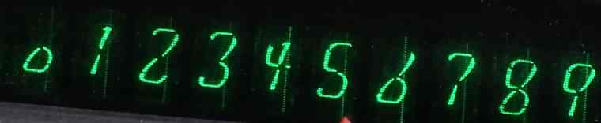
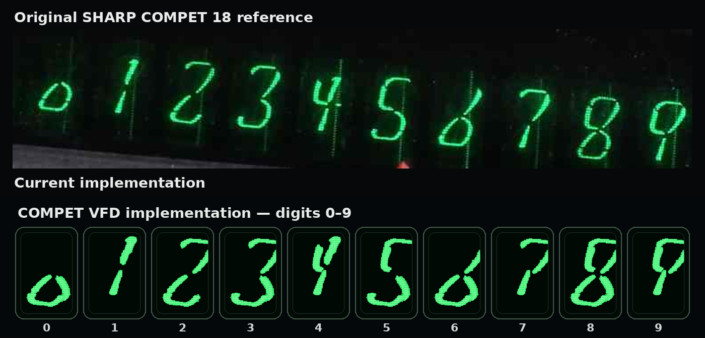
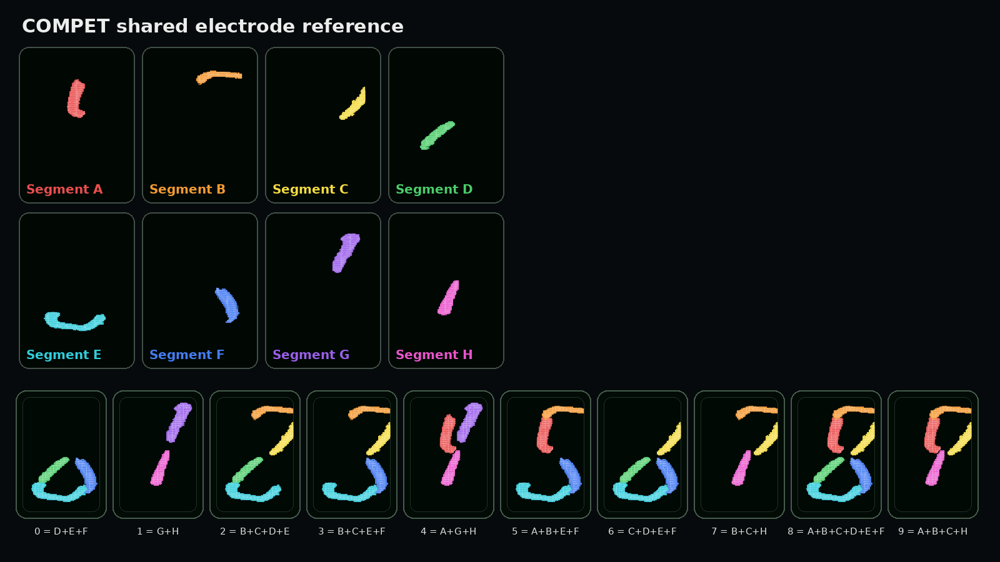

## Segment F correction in v0.5.3

The canonical lower-right electrode `F` is now an independent return segment with a dark optical gap to the shared lower-base electrode `E`. The same corrected mask is reused without transforms in `3`, `5`, `6` and `8`.

<p align="center">
  
</p>

# COMPET VFD Display Card

Photorealistic numeric display card for Home Assistant, reconstructed from the individually switched glass-cylinder display of the 1969 SHARP COMPET 18 calculator.

## Original COMPET electrode model

The default `original` style is derived from perspective-corrected photographs. It uses exactly eight shared physical electrodes and a fine **72×120 matrix with seven phosphor levels** rather than independent hand-drawn numerals.

| ID | Electrode |
|---|---|
| `A` | upper-left return used by 4/5/8/9 |
| `B` | upper roof |
| `C` | upper-right hook |
| `D` | lower-left counterpart of C |
| `E` | lower counterpart of B |
| `F` | lower-right return |
| `G` | upper electrode of 1 |
| `H` | lower electrode of 1 |

```text
0 = D E F
1 = G H
2 = B C D E
3 = B C E F
4 = A G H
5 = A B E F
6 = C D E F
7 = B C H
8 = A B C D E F
9 = A B C H
```

The previous smoother numeral set remains available as `style: alternative`.

## HACS installation

1. Open **HACS → Dashboard**.
2. Open **Custom repositories**.
3. Add `https://github.com/loungelizard2018/compet-vfd-display-card`.
4. Select **Dashboard**.
5. Install the latest release and reload the Home Assistant frontend.

Resource path:

```text
/hacsfiles/compet-vfd-display-card/compet-vfd-display-card.js
```

## Example

```yaml
type: custom:compet-vfd-display-card
entity: sensor.bigpool_ram_usage

integer_digits: 3
decimals: 1
leading_zeroes: false
style: original

label: RAM USAGE
unit: "%"
show_label: true
show_unit: true

frame: gauge_black
screws: true
screw_size: 30
transparent_card: true

glow_color: "#20f56b"
phosphor_color: "#d8ffe3"
inactive_color: "rgba(32,245,107,0.035)"
show_mesh: true

tube_width: 64
tube_height: 124
tube_gap: 8

decimal_marker: true
decimal_marker_color: "#d9362e"

fit_to_card: true
allow_upscale: false
max_fit_scale: 1
```

## Static 0–9 test

```yaml
type: custom:compet-vfd-display-card
value: 123456789
integer_digits: 10
decimals: 0
leading_zeroes: true
style: original
label: COMPET 18 — 0123456789
unit: ""
show_unit: false
```

## Alternative style

```yaml
type: custom:compet-vfd-display-card
entity: sensor.bigpool_ram_usage
integer_digits: 3
decimals: 1
style: alternative
label: RAM USAGE
unit: "%"
```

## Main options

| Option | Default | Description |
|---|---:|---|
| `style` | `original` | `original` photographic matrix or `alternative` smooth paths |
| `integer_digits` | `8` | Integer display tubes |
| `decimals` | `0` | Fractional display tubes |
| `leading_zeroes` | `false` | Fill unused positions with zeroes |
| `glow_color` | `#20f56b` | Active glow colour |
| `phosphor_color` | `#d8ffe3` | Bright phosphor-core colour |
| `inactive_color` | transparent green | Inactive electrode field |
| `decimal_marker` | `true` | External physical decimal marker |
| `decimal_marker_color` | `#d9362e` | Marker centre colour |
| `frame` | `gauge_black` | Black instrument frame or `none` |
| `screws` | `true` | Four mounting screws |
| `fit_to_card` | `true` | Fit instrument to available width |

## Development tools

```bash
npm run verify
python3 -m http.server 8000
```

Then open:

```text
http://localhost:8000/demo/segment-atlas.html
http://localhost:8000/demo/pixel-segment-editor.html
http://localhost:8000/demo/reference-overlay.html
```

## Licence

MIT. This project is not affiliated with or endorsed by SHARP Corporation.

<!-- COMPET_REFERENCE_START -->
## Original reference and shared segment construction

The perspective-corrected SHARP COMPET 18 screenshot is the canonical visual reference:



Side-by-side visual comparison of the original and the current implementation:



The segment atlas below identifies all eight shared electrodes `A–H` and the exact composition of every digit:



| Digit | Shared segments |
|---:|---|
| 0 | D + E + F |
| 1 | G + H |
| 2 | B + C + D + E |
| 3 | B + C + E + F |
| 4 | A + G + H |
| 5 | A + B + E + F |
| 6 | C + D + E + F |
| 7 | B + C + H |
| 8 | A + B + C + D + E + F |
| 9 | A + B + C + H |
<!-- COMPET_REFERENCE_END -->
